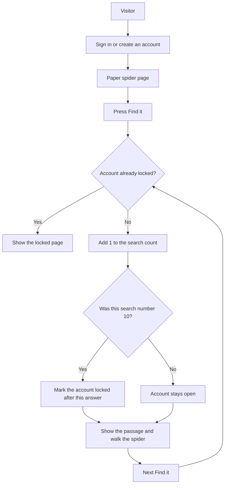

# How a search moves through the site

The count is stored in the `Usage` table, one row per account. `SearchLog` stores the time of each search and whether it was text or a picture. The paper itself is not stored.
